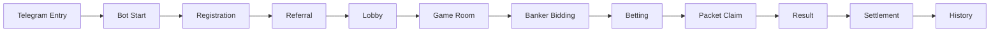

# User Flow

The screenshots supplied by the user confirm a visible entry path of `/Start` reply → Mini App launch button → lobby → game card/rules intro, plus device binding, referral binding and profile/ledger entry points. They do not prove the live backend behavior.

The following is the target demo flow, not a claim about the benchmark Bot.

The Mini App keeps the complete round state in Round Centre so a player does not need to rely on chat messages to understand a result.
